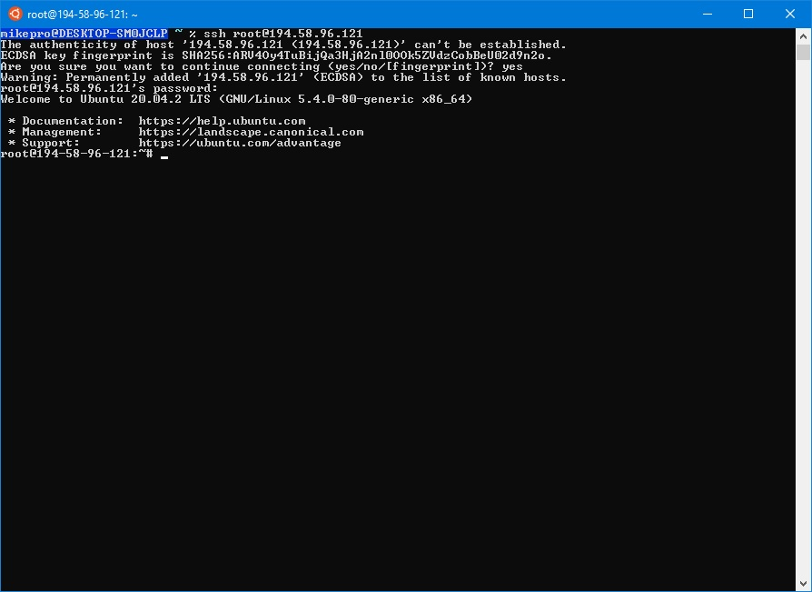

# Решение

## Задание 1



## Задание 2

```
mikepro@DESKTOP-SM0JCLP ~/.ssh
 % ssh-keygen
Generating public/private rsa key pair.
Enter file in which to save the key (/home/mikepro/.ssh/id_rsa):
Enter passphrase (empty for no passphrase):
Enter same passphrase again:
Your identification has been saved in /home/mikepro/.ssh/id_rsa
Your public key has been saved in /home/mikepro/.ssh/id_rsa.pub
The key fingerprint is:
SHA256:j62QW69XW67DT3SAfd71pi5AMHsJdg+lVmV1ZlIRJb0 mikepro@DESKTOP-SM0JCLP
The key's randomart image is:
+---[RSA 3072]----+
|           .o.=*@|
|        = oo + =o|
|       . *o+. o +|
|        ..+ .  E+|
|        So    . *|
|       . +. ...+ |
|      o o o+ +o  |
|       + o. =o.  |
|      . oo. .=o  |
+----[SHA256]-----+
mikepro@DESKTOP-SM0JCLP ~/.ssh
 %


 % ssh-copy-id root@194.58.96.121
/usr/bin/ssh-copy-id: INFO: Source of key(s) to be installed: "/home/mikepro/.ssh/id_rsa.pub"
/usr/bin/ssh-copy-id: INFO: attempting to log in with the new key(s), to filter out any that are already installed
/usr/bin/ssh-copy-id: INFO: 1 key(s) remain to be installed -- if you are prompted now it is to install the new keys
root@194.58.96.121's password:

Number of key(s) added: 1

Now try logging into the machine, with:   "ssh 'root@194.58.96.121'"
and check to make sure that only the key(s) you wanted were added.

mikepro@DESKTOP-SM0JCLP ~/.ssh
 % ssh regru
Welcome to Ubuntu 20.04.2 LTS (GNU/Linux 5.4.0-80-generic x86_64)

 * Documentation:  https://help.ubuntu.com
 * Management:     https://landscape.canonical.com
 * Support:        https://ubuntu.com/advantage
Last login: Mon Aug  2 13:16:16 2021 from 81.200.14.34
root@194-58-96-121:~#

```

## Задание 1

Подключиться к серверу на [reg.ru](https://www.reg.ru/) с помощью [ssh](https://losst.ru/kak-polzovatsya-ssh).

По шагам:

1. Получить доступ к учетной записи на reg.ru. Для этого нужно перейти по ссылке в личном кабинете Нетологии в разделе занятия "Доступ к VPS от Reg.ru" и зарегистрироваться на сайте. 

2. Установить терминал с ssh-клиентом:

- для ubuntu/fedora/centos/etc. - ssh-клиент уже установлен, ничего делать не надо
- для macOS - ssh-клиент уже установлен, ничего делать не надо
- для windows - рекомендуется установить [wsl 2](https://docs.microsoft.com/ru-ru/windows/wsl/install-win10)

3. Создать сервер в личном кабинете на reg.ru (подробности в [создание сервера на reg.ru](./new-server-reg-ru.md))

4. Узнать IP созданного сервера, логин и пароль пользователя на сервере (в своем личном кабинете).

5. Начать управление сервером с помощью ssh (ввести команду в своем терминале):

```bash
ssh имя_пользователя@ip_сервера
```

После этой команды терминал запросит у вас пароль от пользователя (при вводе пароль виден не будет - это сделано специально в целях безопасности).

В качестве результата прикрепите скриншот терминала, когда вы подключились к серверу.

## Задание 2\* (необязательное)

Настройте свой ssh-клиент таким образом, чтобы можно было подключаться к серверу только такой командой (без ввода пароля):

```bash
ssh ваш_псевдоним_сервера
```

Подсказки:

1. Вам нужно узнать про `config` для ssh
2. Разобраться с командой `ssh-copy-id`
